 

# Alexa Gadget Control using the SiLabs Thunderboard EFR32BG22

 


## Objective:
This demo serves to showcase the Amazon Alexa Gadget control service over BLE using the Silicon Labs Thunderboard EFR32BG22

## Registering a gadget in the Alexa Voice Service Developer Console
To create a gadget that works with your Echo device, you first need to register a new gadget in the Alexa Voice Service Developer Console.

1. Sign in to the [Alexa Voice Service Developer Console](https://developer.amazon.com/avs/home.html#/avs/home). If you don't already have a developer account, create one.

 

2. If you haven't registered an AVS product in the past, click **GET STARTED**.

 

3. Click **PRODUCTS**, and then click **ADD NEW PRODUCT**.

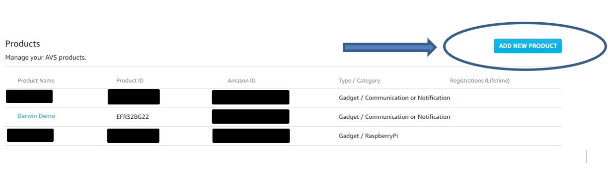 

4. Fill out the requested information, select **Alexa Gadget** as the product type, and then click **FINISH**.

 

5. In the pop-up, click **OK**.
6. You will be taken to a list of your products. Click on the gadget you just created.

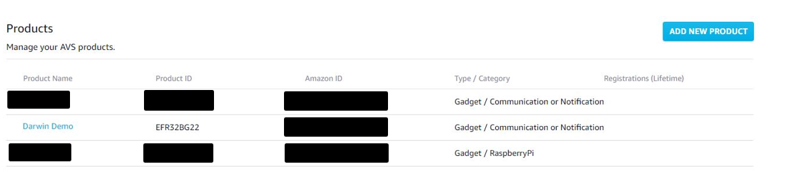 

7. At the top, you'll see an **Amazon ID** and **Alexa Gadget Secret**. You'll need these for the following steps to create your Alexa Gadget. Keep this ID and Secret private because they uniquely identify your gadget.

 

8. Edit "./AlexaDemo/alexa/alexa.h" located in the cloned repository.
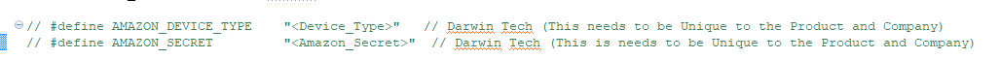 

9. Uncomment these two lines and replace "<Device_Type>" with the **Amazon ID** and "<Amazon_Secret>" with the **Alexa Gadget Secret**.  

10. Once that is complete, compile the source and it is ready to flash to the Thunderboard.

11. Flash the firmware to the Thunderboard and the hardware is ready.

NOTE: To learn more, refer to [Register a Gadget](https://developer.amazon.com/docs/alexa-gadgets-toolkit/register-gadget.html) in the Alexa Gadgets Toolkit documentation.

### Create your Lambda function
1. Sign in to the [AWS Management Console](https://console.aws.amazon.com/lambda/home) and open the [AWS Lambda Console](https://console.aws.amazon.com/lambda/home).

 

2. Make sure the **Region** on the top right corner is set to *N. Virginia*.
3. Click **Create function**, leave **Author from scratch** selected, and name the function whatever you like.

 

4. Select *Runtime* as Python 3.6.
5. For **Permissions**, if you don't already have a role that allows for basic Lambda execution, follow [Defining a New Role for the Function](https://developer.amazon.com/docs/custom-skills/host-a-custom-skill-as-an-aws-lambda-function.html#define-new-role) to create a new role from a template.

6. Click on **Create function**.

 

7. Under the "Function code" block, click the **Actions** drop down and  select **Upload a .zip file**.

 

8. Press the UPLOAD button in the popup window and browse to the zip "Darwin-Demo.zip" located in the the cloned repo, and click upload.

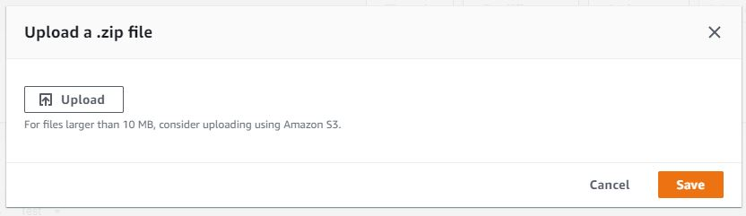 

Note: This zip file contains the skill code, "lambda_function.py", as well as the ASK Python SDK dependencies needed by the skill code.


### Create your skill
1. Sign in to the [Alexa Skills Kit Developer Console](https://developer.amazon.com/alexa/console/ask)</a> and click **Create Skill**.

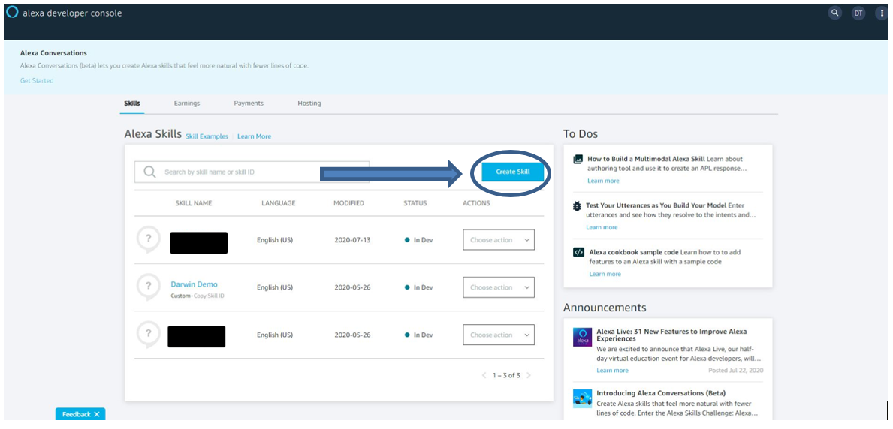 

2. Enter **Skill name** as *Darwin Demo*. Leave the **Choose a model to add to your skill** to *Custom*, and **Choose a method to host your skill's backend resources** to *Provision your own*.
3. Click on **Create skill** on the top right corner of the screen.

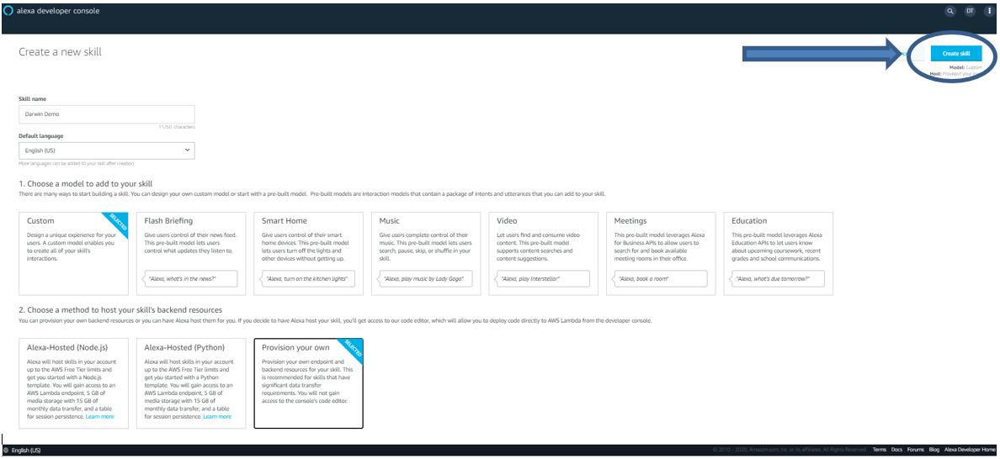 

4. On the **Choose a template** screen, choose *Hello World Skill* and click on the **Choose** button on the top right corner of the screen.

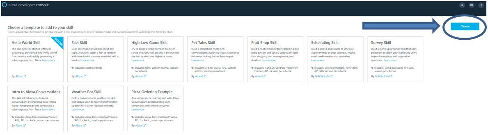 

5. The skill is created. Now, click on **JSON Editor** in the left pane.

 

6. Add utterance samples for Amazon.YesIntent and Amazon.NoIntent as follows:
Note: This sample assumes that the skill is a US-based skill.

    ```json
    {
        "name": "AMAZON.YesIntent",
        "samples": [
            "yes",
            "yes please",
            "sure"
        ]
    },
    {
        "name": "AMAZON.NoIntent",
        "samples": [
            "no",
            "no thanks"
        ]
    },
    ```  


7. Click on **Save Model** on the top.

 

8. On the left, click **Endpoint**.

 

9. Select **AWS Lambda ARN**.

 

10. Copy the skill ID.

 


11. Switch back to your Lambda function in the [AWS Lambda Console](https://console.aws.amazon.com/lambda/home).

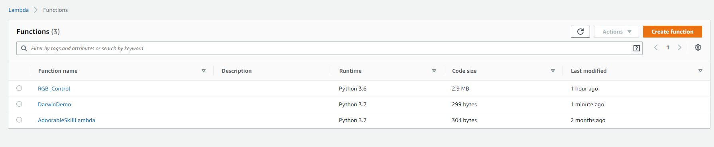 

12. Select "Darwin Demo"

Click on "+ Add trigger"

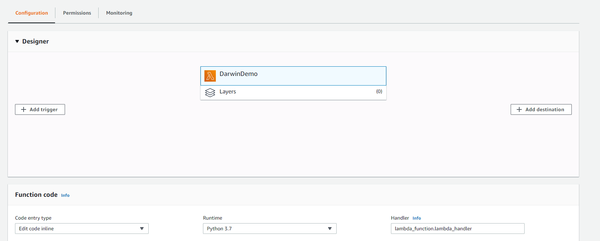 

14. Select "Alexa Skills Kit"
15. Paste the Skill ID you just copied into the field "Skill ID"
16. Then Click **Add**

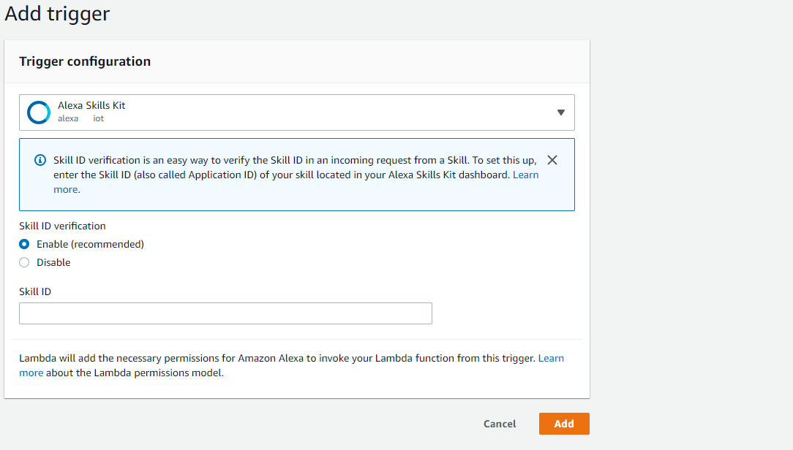 

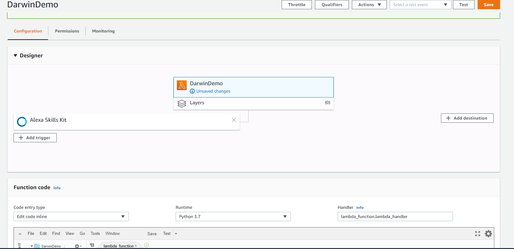 


17. At the top of the screen, copy the ARN.

 

18. Return to editing your skill in the [Alexa Skills Kit Developer Console](https://developer.amazon.com/alexa/console/ask).
19. Within the **Endpoint** section, paste in the Lambda ARN from the function that you created, in the **Default Region** field under **AWS Lambda ARN**, and then click **Save Endpoints**.

 

20. On the left, select **Interfaces** and turn on the toggle for *Custom Interface Controller* to enable the skill to use Custom Interfaces.

 

21. Then, click on **Save Interfaces** at the top of the screen.

 

22. On the left, select **Invocation**. Then, at the top of the screen, click **Build Model**.

 

23. It will take a few seconds to build the model. A Build Successful message will be posted on the bottom right of the screen once the model is built successfully.

 

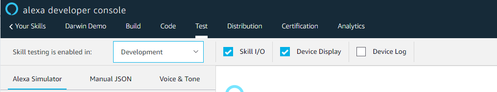 

24. Select Test from the top of the menu bar.
25. Click the drop down menu and change the "Skill testing is enabled in" and change to "Development".
26. Using the Alexa App, Pair the new Gadget to the Amazon echo compatible device.
27. Select devices > Device > Pair Gadget
28. The advertisement is "Alexa Demo"
29. Once Paired, say "Alexa, Open Darwin Demo" 


